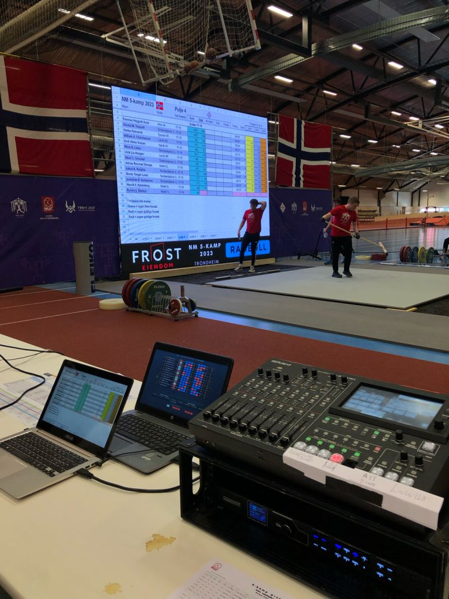

# 5-kamp scoreboard

Denne applikasjonen regner ut score board for 5-kamp konkurranser. Scoar boardet viser hvilket resultat man trenger i gjeldene øvelse for å ta ledelse, andre plass og tredjeplass.



## To install

1. Add API key
2. `cd femkamp`
3. `mvn clean install`

### To run:

`cd femkamp`

`mvn exec:java -Dexec.mainClass="nidelv.backend.App"`
# Hvordan lage executable fil 

Denne guiden viser hvordan du bygger prosjektet til kjørbare filer på flere plattformer.  
Du kan enten lage en **kjørbar JAR** (enkelt, krever Java installert hos brukeren), eller installerbare pakker som inkluderer Java-runtime.

---

## Forutsetninger
- **JDK 17+** installert (sjekk med `java -version`).
- **Maven** installert (sjekk med `mvn -v`).
- `jpackage` følger med JDK 14 og nyere.
- På Linux: `sudo apt install fakeroot rpm` hvis du skal bygge både `.deb` og `.rpm`.
- På Windows: anbefales `WixToolset` hvis du vil lage `.msi`.
- På macOS: krever `xcode-select --install`.

---

## 1. Bygg kjørbar JAR
Hvis du bare vil ha en `.jar`-fil:

```bash
mvn clean package
```

Dette genererer en fil i `target/`:

```
target/femkamp-1.0-SNAPSHOT-jar-with-dependencies.jar
```

Kjør den med:

```bash
java -jar target/femkamp-1.0-SNAPSHOT-jar-with-dependencies.jar
```

> **Merk:** Denne krever at brukeren har Java installert.

---

## 2. Bygg installasjonsfiler med `jpackage`

### Ubuntu/Debian (.deb)
```bash
jpackage \
  --name femkamp \
  --input target \
  --main-jar femkamp-1.0-SNAPSHOT-jar-with-dependencies.jar \
  --main-class nidelv.backend.App \
  --type deb
```

Installer den med:
```bash
sudo apt install ./femkamp_1.0_amd64.deb
```

Kjør med:
```bash
femkamp
```

---

### Fedora/RHEL (.rpm)
```bash
jpackage \
  --name femkamp \
  --input target \
  --main-jar femkamp-1.0-SNAPSHOT-jar-with-dependencies.jar \
  --main-class nidelv.backend.App \
  --type rpm
```

Installer den med:
```bash
sudo rpm -i femkamp-1.0-1.x86_64.rpm
```

---

### Windows (.msi) 
#### OBS! Husk å øk app-version, dersom du vil installere på nytt
```bash
jpackage \
  --name Femkamp \
  --input target \
  --main-jar femkamp-1.0-SNAPSHOT-jar-with-dependencies.jar \
  --main-class nidelv.backend.App \
  --type msi \
  --add-modules java.base,java.desktop,java.logging,java.xml,java.naming,jdk.crypto.ec,jdk.httpserver \
  --icon "./src/main/resources/icon.ico" \
  --win-menu --win-shortcut --win-per-user-install \
  --app-version 1.1.4 \
  --vendor "Femkamp" \


```

---

### macOS (.dmg)
```bash
jpackage \
  --name Femkamp \
  --input target \
  --main-jar femkamp-1.0-SNAPSHOT-jar-with-dependencies.jar \
  --main-class nidelv.backend.App \
  --type dmg
```

---

## 3. Ekstra
- Hvis du vil ha en kjørbar mappe (uten .deb/.rpm/.exe/.dmg), kan du bruke:

```bash
jpackage \
  --name Femkamp \
  --input target \
  --main-jar femkamp-1.0-SNAPSHOT-jar-with-dependencies.jar \
  --main-class nidelv.backend.App \
  --type app-image
```

Dette lager en katalog med en kjørbar binær i `bin/Femkamp`.

- Du kan legge til ikon (format må passe plattformen):
```bash
  --icon icon.png    # Linux
  --icon icon.ico    # Windows
  --icon icon.icns   # macOS
```

---

✅ Nå kan du distribuere enten en enkel `.jar` eller en ferdig installasjonsfil for Ubuntu, Fedora, Windows eller macOS!